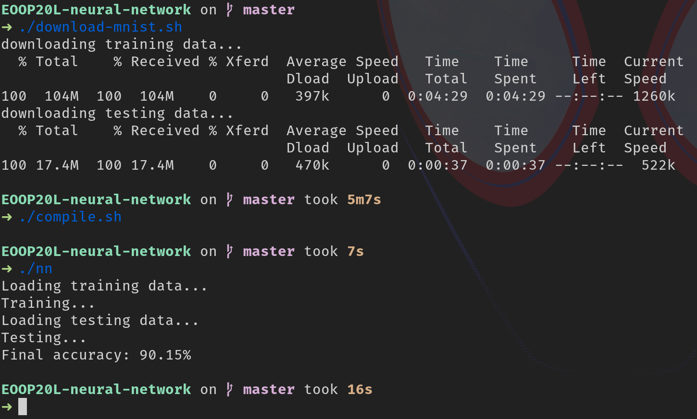

# EOOP20L: Neural Network

For a description of the project see [this](doc/preliminary.md) (some info is outdated because there has been changes in the source code since)

- run in debug mode with `./scripts/run.sh`
- run unit tests with `./scripts/test.sh`
- compile in release mode with `./scripts/compile.sh`
- download mnist database with `./scripts/download-mnist.sh`

## run against MNIST

1. download training/testing data (~120MB)
2. compile the project
3. run and wait for results

