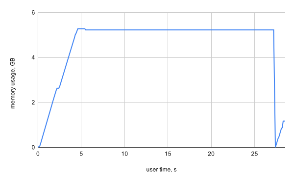

# File structure

```
|-- doc
|   |-- final.md
|   `-- preliminary.md
|-- include
|   `-- NN
|       |-- config.hpp
|       |-- functions.hpp
|       |-- matrix.hpp
|       |-- neural_network.hpp
|       `-- serialize.hpp
|-- src
|   |-- main.cpp
|   |-- config.cpp
|   |-- functions.cpp
|   |-- matrix.cpp
|   |-- neural_network.cpp
|   `-- serialize.cpp
|-- test
|   |-- main.cpp
|   |-- config.hpp
|   |-- functions.hpp
|   |-- matrix.hpp
|   `-- neural_network.hpp
|-- compile.sh
|-- test.sh
|-- run.sh
`-- README.md
```

- `doc/`: contains documentation of this project
- `include/`: header files
- `test/`: unit tests
- `src/`: source code
- `*.sh`: scripts for debugging, compiling, and testing the code

# Differences with respect to the preliminary project

1. `Matrix` has a clear distinction between a dot product and element-wise multiplication, denoted by `static Matrix::dot` and `Matrix::operator*` respectively
2. Class declaration were missing access modifiers when inheriting, so i.e. `class Config : Serializer<Config>` was changed to `class Config : public Serializer<Config>`
3. `Matrix` had an index signature marked as `const`, this is not true since it returns a mutable reference to its contents
4. C style function type declarations were replaced with `std::function`
5. The `Reducing` function in `NNFunctions` actually accepts 2 vectors. It's necessary since the cost function has to compare the output with the expected one
6. `NeuralNetwork`'s `guess` was renamed to `classify` to more clearly show intent
7. `clang-format`'s preset was changed to Chromium

# Implementation

- The NN starts by initializing and randomizing its weights/biases in the range of -1..1
- Feedforward saves individual neuron values
- Backpropagation calculates the errors, gradients, and deltas. Then it adjusts the weights and biases
- Classification feedforwards its inputs and returns an integer representing the index of the output neuron with the highest value
- Train runs for `n` epochs with an online training method on a randomized order training set
- Test checks how many times the classification was correct and returns the percentage. This is parallelized: each thread runs different test samples and there is an atomic counter which keeps track of the corrected guesses

# Running against MNIST


MNIST is a popular database of labeled grey-scale handwritten digits. It contains a total of 70 000 samples, split into 2 chunks for training and testing (60k and 10k respectively). It is often used when testing if a NN works at all. The problem is considered easy so it serves purely as a baseline.

My NN will get a picture fed into it after which it will predict which digit it thinks it is.

## Parameters

### Input

These images are $28\times28$ resulting in 784 pixels. Since they are grey-scale, each pixel can be represented by one byte where 0 is black and 255 is white. Therefore NN's input is a vector of 784 normalized pixels: `pixel_brightness / 255`.

### Output

The NN could have one output neuron where ranges in 0-1 would represent some digit (for example 0-1/11 would be a zero), however NNs perform better during classification problems when each desired output has an assigned output neuron. Thus there will be 10 output neurons.

### Hyper-parameters

Chosen somewhat arbitrarily:

- 2 hidden layers
- 16 hidden neurons per layer
- 1% learning rate

I do not know how to optimize those, so I tried different ones and settled on something that worked best.

### Functions

Neurons are activated with the sigmoid function, last layer is normalized with a softmax function, and lastly the optimized cost function is a mean squared function.

ReLU is said to perform significantly better however without weight normalization (which I have not implemented), ReLU quickly gets out of hand so I could not use it here.

## Process

```cpp
const size_t RESOLUTION = 28 * 28;

struct Digit {
  uint8_t label;
  std::array<uint8_t, RESOLUTION> pixels;
};
```

First the training data is loaded (from a pre-downloaded `csv` file) and parsed into a vector of `Digit`. Pixels are flatten into a 1D bytes array. Then `Digit` is stripped of the label and the `std::array` is turned into a `Matrix` so it can be fed into the NN. The NN is then trained for 5 epochs (totalling to 300 000 iterations).

Afterwards the data parsing and preparation is repeated for the testing data. The data is used to test the trained NN and check its accuracy.

After running it for a couple of times, the average accuracy ended up being 92%.

## Benchmarks

### Memory

Since the whole dataset is loaded into memory (greatly reduces the overhead of constantly switching between training and loading new data) the usage will be big.

#### Method

The project is compiled with `-O3` and then ran. Then simultaneously the memory usage of the process is logged every 100ms with the `ps(1)` command. The data is then put into a spreadsheet and the results are graphed.

#### Results

&nbsp;<!-- h4 is inlining its content, this hack prevents that -->



#### Analysis

1. $0 \to 0.2s$ (Parsing training csv): The memory used is only 56MB (which is less than the csv file itself). The data is efficiently stored in `Digit` instances. Each instance takes only $784 + 1 = 785$ bytes
2. $0.2 \to 2.5s$ (Preparing NN inputs): The previously parsed data is turned into Matrices which greatly inflates memory usage: 2.7GB. This is because a `Matrix` stores data in a `double` meaning it is 8 times bigger than a `Digit`. A `Matrix` also has to hold a vector of vectors which adds additional costs
3. $2.5 \to 5s$ (Preparing NN outputs): Each label has to be turned into a $10\times1$ `Matrix`. So 10 doubles, meaning a label is now represented by something 80 times bigger. Memory reaches its peak: 5.3GB
4. $5 \to 27.2s$ (Training): All memory is now kept and trained on. There are some temporary variables created on the way.
5. $27.2s$: The training data is dropped
6. $27.2 \to$ end (Testing): The process is repeated for testing data, thus the shape is the same just the memory ends up 6 times smaller: 1.17GB (_it is not actually 6 times smaller because the NN stores pretty large Matrices which are not dropped before testing_)

### Time

#### Method

Before a function is called `std::chrono::high_resolution_clock::now()` is noted, after the function has finished executing `::now()` is noted once more to check the elapsed time. Therefore these benchmarks check user time, not CPU clock cycles. Each function is tested 20 times after which the averages and standard deviations are calculated.

All tests done on an `Intel i5-4300U (4) @ 2.900GHz` (thought the relative values should not be affected by the kind of CPU).

#### Results

&nbsp;<!-- h4 is inlining its content, this hack prevents that -->


1. **training** 76.83%: 22.531s $\pm$ 127ms
2. **preparing training data** 18.88%: 5.536s $\pm$ 15ms
3. **preparing testing data** 3.11%: 911ms $\pm$ 7ms
4. **load/parse training data** 0.66%: 194ms $\pm$ 2ms
5. **testing** 0.40%: 117ms $\pm$ 10ms
6. **load/parse testing data** 0.12%: 34ms $\pm$ 0ms

**Total**: 29.324s $\pm$ 143ms

#### Analysis

Unsurprisingly training takes most of the time. Following that is the preparation of data: many Matrices have to be allocated and iterated over. Loading the csv files happens pretty quickly: other than one vector everything is allocated statically. Since testing is parallelized and does not require backpropagation it is fast.

Additionally I notice testing has a relatively higher deviation than other stages; this is likely due to the parallelization resulting in some random fights for the lock.

# Ending reflections

I consider this project to be a success and I believe it had greatly broadened my C++ and NN knowledge.

Possible enhancements:

1. Using SIMD. This would be a perfect occasion to use SIMD since a lot of the vector instructions could be just performed at the same time. (Perhaps `g++` applied some automatic vectorization already?)
2. Normalizing weights. ReLU is unusable currently
3. Mini-batches. They are an effective way of training a NN. Would also simplify parallelization
4. Generalizing `Matrix` to any dimension. This would remove the need of a vector of weights, then I could just have a third dimension
5. Classification based on probability. Currently it just chooses the highest value neuron, since softmax gives a probability distribution classify could use that
