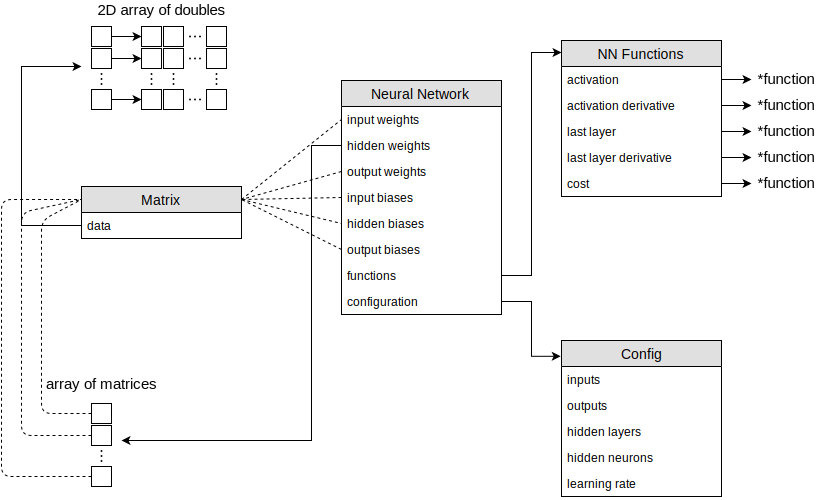

_Disclaimer_: This document is not meant to be an explanation of the inner workings of a Neural Network. It will strictly focus on the interface and implementation.

## 1. Description

This project will focus on implementing a basic multilayer perceptron (known as an ANN: Artificial Neural Network) stripped of all of the more advanced concepts like normalizing weights, mini-batch training, or vectorized computation. The implementation will consist of 5 classes in total, each handling a separate part of what a Neural Network forms.

As a Proof of Concept I will train a NN to solve the [XOR](https://medium.com/@jayeshbahire/the-xor-problem-in-neural-networks-50006411840b) problem: it is known as a simple non-linear problem that requires at least one hidden layer in order to be solved, thus solving it proves that a given NN is able to solve other arbitrary non-linear problems. More or less effectively, but still. If time allows, the NN will be also put against the [MNIST database](https://en.wikipedia.org/wiki/MNIST_database).

### Classes

#### Serializer

This class only exists as a base of a different one; it is an abstract class. It requires that deriving classes have implemented a serialize method and a static deserialize method. Then, the `Serializer` is able to provide such methods as `from_file` or `to_file`, allowing for easy serialization handling no matter who is the parent class.

This class will prove to be very useful when saving the NN's weights to a file and then loading them back in whenever needed. This allows for an interruptible training cycle. Additionally it unlocks the ability of configuring the NN from a text file rather than fiddling with code.

#### Config

`Config` conforms `Serializable`[^1]. Stores the learning rate and the sizes of the network: input, output, hidden layers, hidden neurons.

#### Matrix

The main purpose of the `Matrix` class is to simplify matrix operations. It will override the 4 basic arithmetic operators `*/-+` providing a layer of abstraction when using 2d arrays. `*-+` will work for both scalars and other matrices while `/` will be constrained to just scalars. Additionally there will be 2 other linear algebraic operations: transposition and the dot product. Cross product will be omitted on purpose: while it would be great for completeness, the usefulness is minimal.

`Matrix` conforms `Serializable` as well.

#### NNFunctions

`NNFunctions` stores function used by the NN: activation function, derivative of the activation function, output layer function, derivative of the output layer function, and cost function. Constructing a `NNFunction` object consists of providing the previously mentioned functions, or choosing ready functions from an enum.

`NNFunctions` is `Serializable` only if the chosen functions are from the preset, custom ones can't be serialized.

#### NeuralNetwork

This is the _brain_ class. Uses all of the classes above to construct a friendly interface for training and performing guesses.

## 2. Memory map

The neural network owns all of its data (except pointers to functions which have static lifetimes).

Dotted lines indicate that the data has a structure of the connected type (they don't all point to the same `Matrix` instance).

\

## 3. Class declarations

The lack of raw pointers is a conscious decision. They are a source of bugs and if a need for pointers will arise, smart pointers will be used instead. Because all properties are auto-cleaned/copied no destructors or copy constructors are present.

### Serializer

```cpp
template <typename T>
class Serializer {
 protected:
  /// protected on purpose, Serializer is an abstract class
  Serializer();

 public:
  /// deserializes a file into the parent object.
  /// throws if file does not exist
  static auto from_file(const string& path) -> T;

  /// takes a path and serializes the parent into the pointed file.
  /// overwrites all content if the file already exists
  auto to_file(const string& path) const -> void;

  /// prints the serialized object
  // friend auto operator<<<>(ostream& os, const T& obj) -> ostream&;

  /// virtual methods that have to be implemented by parent classes
  /// then the serializer can work properly
  virtual auto serialize() const -> string = 0;
  /// this is impossible in c++, therefore it only serves purely as
  /// documentation
  // virtual static auto deserialize(const string& str) -> T = 0;
};
```

### Config

```cpp
class Config : Serializer<Config> {
 public:
  /// properties of a neural network
  /// because they are constant, there is no need encapsulating them
  const unsigned int inputs, outputs, layers, hidden_neurons;
  const double learning_rate;

  /// constructor accepting all 4 parameters
  Config(const unsigned int inputs, const unsigned int outputs,
         const unsigned int layers, const unsigned int hidden_neurons,
         const double learning_rate);

  /// overriding the virtual methods of Serializer
  auto serialize() const -> string override;
  static auto deserialize(const string& str) -> Config;
};
```

### Matrix

```cpp
class Matrix : Serializer<Matrix> {
 public:
  /// size of the matrix
  const unsigned int rows, columns;

  /// constructor takes the dimensions of the matrix
  Matrix(const unsigned int rows, const unsigned int columns);

  /// randomizes the matrix with a given range
  auto randomize(const double min = -1.0, const double max = 1.0) -> void;

  /// operator overloads for matrix operations
  /// if on both sides of the operation theres a matrix then the operation is
  /// done element wise, unless it is * where a matrix multiplication is
  /// performed instead
  /// in-place
  auto operator+=(const Matrix& rhs) -> Matrix&;
  auto operator+=(const double& rhs) -> Matrix&;
  auto operator-=(const Matrix& rhs) -> Matrix&;
  auto operator-=(const double& rhs) -> Matrix&;
  auto operator*=(const double& rhs) -> Matrix&;
  auto operator/=(const double& rhs) -> Matrix&;
  /// global
  friend auto operator+(const Matrix& lhs, const Matrix& rhs) -> Matrix;
  friend auto operator+(const Matrix& lhs, const double& rhs) -> Matrix;
  friend auto operator-(const Matrix& lhs, const Matrix& rhs) -> Matrix;
  friend auto operator-(const Matrix& lhs, const double& rhs) -> Matrix;
  friend auto operator*(const Matrix& lhs, const Matrix& rhs) -> Matrix;
  friend auto operator*(const Matrix& lhs, const double& rhs) -> Matrix;
  friend auto operator/(const Matrix& lhs, const double& rhs) -> Matrix;
  /// indexing
  auto operator[](size_t idx) const -> vector<double>&;

  /// transposing flips the x and y axis
  auto transpose() const -> Matrix;

  /// overriding the virtual methods of Serializer
  auto serialize() const -> string override;
  static auto deserialize(const string& str) -> Matrix;

 private:
  /// thats where the data is stored. Vector was chosen because while the
  /// size is immutable and array would seem like a more fitting choice, vector
  /// provides a much safer interface with negligible overhead
  vector<vector<double>> data_;
};
```

### NNFunctions

```cpp
class NNFunctions : Serializer<NNFunctions> {
 public:
  /// enums listing available function
  /// __custom means the function was provided
  enum class Activation { sigmoid, relu, tanh, __custom };
  enum class LastLayer { softmax, __custom };
  enum class Cost { mean_square, __custom };

  /// type definitions of the functions
  /// a function that takes a double and decides if its active
  typedef auto (*Activating)(double) -> double;
  /// a function that takes an array of doubles and maps it to different values
  typedef auto (*Mapping)(vector<double>) -> vector<double>;
  /// a function that takes an array of doubles and reduces it to a single value
  typedef auto (*Reducing)(const vector<double>&) -> double;

  /// collection of functions
  const Activating activation, d_activation;
  const Mapping last_layer, d_last_layer;
  const Reducing cost;

  /// constructor accepting enums describing pre-made functions
  NNFunctions(Activation af, LastLayer llf, Cost cf);
  /// constructor accepting functions
  NNFunctions(const Activating af, const Activating daf, const Mapping llf,
              const Mapping dllf, const Reducing cf);

  /// overriding the virtual methods of Serializer
  auto serialize() const -> string override;
  static auto deserialize(const string& str) -> NNFunctions;

 private:
  /// remembering which functions were chosen, this information is needed for
  /// serialization
  Activation af_;
  LastLayer llf_;
  Cost cf_;
};
```

### NeuralNetwork

```cpp
class NeuralNetwork : Serializer<Matrix> {
 public:
  /// constructor takes the previously defined configuration
  NeuralNetwork(Config config, NNFunctions funcs);

  /// performs a classification guess, it is not meant for regression problems
  auto guess(const Matrix& inputs) const -> unsigned int;

  /// trains the network `n` amount of times using online training
  /// inputs and expected have to me linearly aligned: first element of inputs
  /// have to correspond to first element from expected and so on
  auto train(const vector<Matrix>& inputs, const vector<Matrix>& expected,
             unsigned int n) -> void;

  /// overriding the virtual methods of Serializer
  auto serialize() const -> string override;
  static auto deserialize(const string& str) -> NeuralNetwork;

 private:
  /// weights of the connections
  Matrix input_w_;
  vector<Matrix> hidden_w_;
  Matrix output_w_;

  /// biases of the neurons
  Matrix input_b_;
  Matrix hidden_b_;
  Matrix output_b_;

  /// functions
  NNFunctions funcs_;

  /// config
  Config config_;

  /// sends inputs through the whole network and returns the output layer
  auto feedforward(const Matrix& inputs) const -> Matrix;

  /// backpropagates the expected output from some input, adjusts the weights,
  /// then returns the cost of the network
  auto backpropagate(const Matrix& inputs, const Matrix& expected) -> double;
};
```

## 4. Demos

Objects are easily saveable

```cpp
Matrix m(10, 12);
m.save_to("/path/to/file");
```

Not all of them though

```cpp
NNFunctions f(NNFunctions::Activation::relu, NNFunctions::LastLayer::__custom,
              NNFunctions::Cost::mean_square);

m.serialize(); // throws an exception, a custom function was used    ^^^^^^^^
```

Matrices can be multiplied only if the sizes align

```cpp
Matrix m1(1, 2);
Matrix m2(2, 2);
Matrix m3(3, 2);

m1 * m2; // ok
m1 * m3; // error!
```

They can be also scaled/moved by scalars

```cpp
Matrix m(10, 10);

m += 1;
m -= 2;
m *= 3;
m /= 4;
```

Or added element wise

```cpp
Matrix m1(2, 2);
Matrix m2(2, 2);
Matrix m3(3, 2);

m1 += m2;
m1 -= m2;
m1 += m3; // error, sizes do not align
```

Elements can be accessed (for reading and writing) with the index operator

```cpp
Matrix m(3, 2);

m[1][0] = 1.2;

Matrix m2 = m.transpose();

assert(m2[0][1] == 1.2); // ok
```

The neural network provides a very high level API, only `guess` and `train` methods are available

```cpp
// XOR example
auto nn = NeuralNetwork::from_file("./backup");

vector<Matrix> inputs;
vector<Matrix> expected;

// false false -> false
{
  Matrix i(2, 1);
  i[0][0] = 0.0;
  i[1][0] = 0.0;
  inputs.push_back(i);

  Matrix e(2, 1);
  e[0][0] = 1.0;
  e[1][0] = 0.0;
  expected.push_back(e);
}

// false true -> true
{
  Matrix i(2, 1);
  i[0][0] = 0.0;
  i[1][0] = 1.0;
  inputs.push_back(i);

  Matrix e(2, 1);
  e[0][0] = 0.0;
  e[1][0] = 1.0;
  expected.push_back(e);
}

// true false -> true
{
  Matrix i(2, 1);
  i[0][0] = 2.0;
  i[1][0] = 0.0;
  inputs.push_back(i);

  Matrix e(2, 1);
  e[0][0] = 0.0;
  e[1][0] = 1.0;
  expected.push_back(e);
}

// true true -> false
{
  Matrix i(2, 1);
  i[0][0] = 1.0;
  i[1][0] = 1.0;
  inputs.push_back(i);

  Matrix e(2, 1);
  e[0][0] = 1.0;
  e[1][0] = 0.0;
  expected.push_back(e);
}

nn.train(inputs, expected, 1000);

assert(nn.guess(inputs[0]) == 0);
assert(nn.guess(inputs[1]) == 1);
assert(nn.guess(inputs[2]) == 1);
assert(nn.guess(inputs[3]) == 0);
```

There are unit tests for every method. They can be found [on GitHub](https://github.com/shilangyu/EOOP20L-neural-network/tree/master/test).

---

- The code is formatted using `clang-format` with the `Google` preset
- Compiled with `g++` version 9.2 with the `-std=c++2a` flag
- Naming convention:
  - Type aliases, classes, structs, enums, concepts: PascalCase
  - Private fields: snake_case with an underscore at the end
  - All of the rest: snake_case
- Return types will be annotated with the `auto <name>() -> <type>` syntax
- Project is hosted [on GitHub](https://github.com/shilangyu/EOOP20L-neural-network)

[^1]: Serializable: a class that implements the `serialize` and `deserialize` methods
